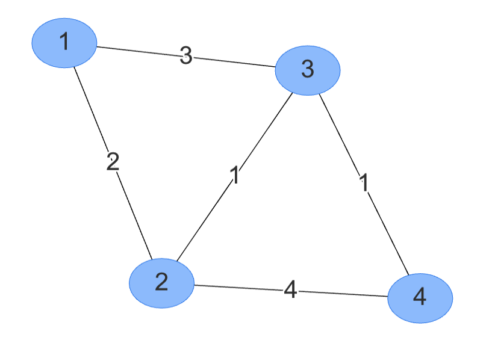

# EE538 Final Project - Spring 2023 - TrojanMap

# (the report of my project is in REPORT.md)

The project is **optional**: you can select one of the following options:

1. Work on the project and submit the reports.
2. Submit homework assignments (HW4, 5, 6).

If you choose to work on the project, you don't have to submit the remaining homework assignments. Similarly, if you choose to work on the homework assignment, you do not have to submit the project. 

You should inform us of your choice by the first due date (Sunday, April 9).

#### Who should work on the project?
If you plan to become a software engineer, we recommend working on the project as it will give you more experience coding a real-life project. Otherwise, you can take the homework assignments.

Not everything in the project is covered in the class. The idea is for you to do some quick research and figure them out. For example, you should read about handling regular expressions in C++.

#### Which one is harder?
We expect both options to take a similar amount of time. The project, however, might require extra effort from you during the environment setup and installation prerequisites.

#### How many students in each team?
Each team should consist of one or two students. You can find a teammate who is in other sections of the course. You should select your teammates by the first due date (April 9).

#### What should I submit?
The project is submitted in different phases. You are required to submit the following:

1. Phase 1, 2, and 3: these should be submitted on GitHub.
2. Video presentation: you and your teammate will create a 3-4 minute video, post it as an unlisted video on Youtube and submit the link. The video should include:
   - Teammates introduction
   - Demo of the executable
   - Quick overview of the algorithm and code architecture
   - Tables, plots and comparisons
   - No coding details in the video

   Here is a [sample video from the previous semester.](https://www.youtube.com/watch?v=_KDML4Ck3SU&t=4s) 

3. A final report in the README file of your GitHub submission. The final report should include the questions that are asked in this README file, your tables and plots for the runtime results, and any other detail of your code.

## Due Dates

- Phase 1: Sunday, April 9, 23:59 pm
- Phase 2: Friday, April 14, 23:59 pm
- Phase 3: Friday, April 28, 23:59 pm
- Video Presentation: Friday, April 28, 23:59 pm
- Report: Friday, May 5, 23:59 pm

## TrojanMap

This project focuses on using data structures in C++ and implementing various graph algorithms to build a map application.

<p align="center"></p>

- Please clone the repository, read through [README.md](README.md), and implement the functions of the project.
- Please make sure that your code can run `bazel run` and `bazel test`.
- You need to fill in [trojanmap.cc](src/lib/trojanmap.cc), [mapui.cc](src/lib/mapui.cc) and maybe [mapui.h](src/lib/mapui.h), and add unit tests in the `tests` directory.
- We will use the autograder to grade some of the questions
- We will compare the code similarity between submissions and the previous semester's submissions. Please complete the project within your group.
---

## My Project Presentation Video on Youtube

[Siting Lu's EE538 Final Project Video](https://youtu.be/oqM1av1WS4U)


## The Data Structure

Each point on the map is represented by the class **Node** shown below and defined in [trojanmap.h](src/lib/trojanmap.h).

```cpp
// A Node is the location of one point in the map.
class Node {
 public:
  Node(){};
  Node(const Node &n) {
    id = n.id;
    lat = n.lat;
    lon = n.lon;
    name = n.name;
    neighbors = n.neighbors;
    attributes = n.attributes;
  };
  std::string id;    // A unique id assigned to each point.
  double lat;        // Latitude
  double lon;        // Longitude
  std::string name;  // Name of the location. E.g. "Bank of America".
  std::vector<std::string>
      neighbors;  // List of the ids of all neighbor points.
  std::unordered_set<std::string>
      attributes;  // List of the attributes of the location.
};
```

---

## Prerequisites
The details of the environment setup will be reviewed in the discussion session. Please do not miss that class!

### External Libraries Installation

For visualization, we use `OpenCV` library. You will use this library as a black box and don't need to worry about the graphic details. Use the following commands to install OpenCV and other libraries.

#### For macOS Users

Step 1. Type the following three lines in your terminal.
```shell
$ brew install cmake
$ brew install opencv
$ brew install ncurses
```

Step 2. Check the installation paths of opencv and ncurses by

```shell
$ brew info opencv
```

and

```shell
$ brew info ncurses
```

respectively, and update their paths in the `WORKSPACE` file of your project root directory with the actual installation paths.


#### For Ubuntu users
Step 1. Type the following lines in your terminal.

```shell
$ cd **your project folder**
$ git clone https://github.com/opencv/opencv.git
$ sudo apt update
$ sudo apt install cmake libgtk2.0-dev pkg-config
$ sudo apt install libcanberra-gtk-module libcanberra-gtk3-module
$ sudo apt install libncurses5-dev libncursesw5-dev
$ cp ubuntu/* ./
```

Step 2. Make sure you set the **path_to_install_folder** to be the absolute path to the **install** folder under opencv when running the following commands.

```shell
$ cd opencv/
$ mkdir build install
$ cd build
$ cmake -D CMAKE_INSTALL_PREFIX=**path_to_install_folder** -D BUILD_LIST=core,highgui,imgcodecs,imgproc,videoio ..
$ make install
```

For example, if cloned this repo under `"/Users/ari/github/TrojanMap"`, you should type:

```shell
$ cd opencv/
$ mkdir build install
$ cd build
$ cmake -D CMAKE_INSTALL_PREFIX=/Users/ari/github/TrojanMap/opencv/install -D BUILD_LIST=core,highgui,imgcodecs,imgproc,videoio ..
$ make install
```

## Run the program

For macOS users, run

```shell
$ bazel run src/main:main
```

For Ubuntu users, run
               
```shell
$ bazel run --cxxopt='-std=c++17' src/main:main
```

If everything is correct, a menu similar to this will show up.

```shell
TrojanMap Menu
**************************************************************
* Enter the function number (1-11) to start:                  
* 1. Autocomplete                                             
* 2. Find the location                                        
* 3. Find all location categories                             
* 4. Get all locations of a category                          
* 5. Get location matching regular expression                 
* 6. CalculateShortestPath                                    
* 7. Cycle Detection                                          
* 8. Topological Sort                                         
* 9. Traveling salesman problem                              
* 10. Find Nearby                                              
* 11. Find Path to Visit All Places
* 12. Check Exist of Path with Constrain
* 13. Exit                                                     
**************************************************************
```

## Test The Program

We created some tests for you to test your program, please run
```shell
$ bazel test tests:trojanmap_test
```

> You may also need to add the `--cxxopt='-std=c++17'` flag if you are using Linux.

Please add you test in the [trojanmap_test_student.cc](tests/trojanmap_test_student.cc) and run

```shell
$ bazel test tests:trojanmap_test_student
```

## Item 1: Autocomplete The Location Name (Phase 1)

```c++
std::vector<std::string> TrojanMap::Autocomplete(std::string name) {
   std::vector<std::string> results;

    if (name==""){
    return results;
  }
  
  std::transform(name.begin(), name.end(), name.begin(), ::tolower);
  for (const auto& node : data){
    std::string node_name = node.second.name;
    std::transform(node_name.begin(), node_name.end(), node_name.begin(), ::tolower);
    if(node_name.find(name) == 0) {
      results.push_back(node.second.name);
    }
  }

  return results;

}
```

We consider the names of nodes as the locations. Implement a method to type the partial name of the location and return a list of possible locations with the partial name as the prefix. Please treat uppercase and lowercase as the same character. Please return an empty output if the input string is empty.

Example:

Input: "Chi" \
Output: ["Chick-fil-A", "Chipotle", "Chinese Street Food"]

Example:

```shell
**************************************************************
* 1. Autocomplete                                             
**************************************************************

Please input a partial location:ch
*************************Results******************************
Chinese Street Food
Cheebos Burger
Chick-fil-A
Chase
Chevron 1
Chipotle
Chase Plaza Heliport
Chevron 2
Church of Christ
Chucks Chicken & Waffles
Chevron
**************************************************************
Time taken by function: 2 ms
```

- What is the runtime of your algorithm? 

   The runtime of this algorithm is O(n), where n is the number of nodes in the data map.

- (Optional) Can you do it faster than `O(n)`?

   No, it is not possible to do this faster than O(n) as we need to examine every node in the map at least once to determine if it matches the search string.


## Item 2-1: Find the place's coordinates in the Map (Phase 1)

```c++

std::pair<double, double> TrojanMap::GetPosition(std::string name) {
 
  
  std::pair<double, double> results(-1, -1);
  if (name==""){
    return results;
  }

  std::string id = GetID(name);
  if (!id.empty()) {
    results.first = GetLat(id);
    results.second = GetLon(id);
  }
  return results;
}


```

Given a location name, return the latitude and longitude. There are no duplicated location names. You should mark the given locations on the map. If the location does not exist, return (-1, -1). The algorithm is case-sensitive.

Example:

Input: "Target" \
Output: (34.0257016, -118.2843512)

```shell
**************************************************************
* 2. Find the position                                        
**************************************************************

Please input a location:Target
*************************Results******************************
Latitude: 34.0257 Longitude: -118.284
**************************************************************
Time taken by function: 1 ms
```

<p align="center"></p>

## Item 2-2: Check Edit Distance Between Two Location Names (Phase 2)

```c++
int TrojanMap::CalculateEditDistance(std::string a, std::string b) {     
  // return 0;
if (typeid(a) == typeid(std::string)) {
  std::transform(a.begin(), a.end(), a.begin(), ::tolower);
}
if (typeid(b) == typeid(std::string)) {
  std::transform(b.begin(), b.end(), b.begin(), ::tolower);
}

 if (a == b){
    return 0;
  }
  //row
  int m = a.length();
  //column
  int n = b.length();

  // Create a 2D vector to store the edit distances
  std::vector<std::vector<int>> dp(m + 1, std::vector<int>(n + 1, 0));

  // Initialize the first row with values from 0 to n
  for (int i = 0; i <= n; i++) {
    dp[0][i] = i;
  }

  // Initialize the first column with values from 0 to m
  for (int i = 0; i <= m; i++) {
    dp[i][0] = i;
  }

  // Fill in the remaining cells of the dp table
  for (int i = 1; i <= m; i++) {
    for (int j = 1; j <= n; j++) {
      // If the characters at the current positions are the same,
      // no operation is needed, so the cost is 0
      if (a[i - 1] == b[j - 1]) {
        dp[i][j] = dp[i - 1][j - 1];
      }
      // If the characters are different, take the minimum of
      // inserting, deleting, or replacing a character
      else {
        dp[i][j] =
            1 + std::min({dp[i][j - 1], dp[i - 1][j], dp[i - 1][j - 1]});
      }
    }
  }

  // The bottom-right cell of the dp table contains the final edit distance
  return dp[m][n];


}
```

When entering a location name that does not exist in the map, your program should determine whether the input can be replaced with a "similar name" or not. By "similar names" we mean the names that exist in the map with a *smallest distance* from the original input. 

The distance between two names A and B is the minimum number of operations required to convert A to B. There are 3 operations:
+ Insert a character
+ Delete a character
+ Replace a character

If the exact match is found, it will be shown on the map. Otherwise, the map will show the most similar name by using FindClosestName and print a warning. 

For example, if I type *Rolphs*, I should get a warning like "Did you mean *Ralphs* instead of *Rolphs*?". 

Write a dynamic programming solution to calculate edit distance. 

```c++
std::string TrojanMap::FindClosestName(std::string name) {
  // std::string tmp = ""; 
  // return tmp;

  std::string tmp = ""; 
  int min_D = INT_MAX;
  for (const auto& node : data){
    if (node.second.name.empty()) {
      continue;
    }
    int distance = TrojanMap::CalculateEditDistance(name, node.second.name);
    if (distance <= min_D){
      min_D = distance;
      tmp = node.second.name;
    }
  }
  return tmp;

}
```

Notes:
- Space can be treated like other characters.
- Spell checking part should be case insensitive.

Example:

Input: "Rolphs", "Ralphs" \
Output: 1


In the user interface of your program, you should show the names that have the minimum edit distance to the name that the user entered.

Example:

Input: "Rolphs"\
Output: "Ralphs"

```shell
**************************************************************
* 2. Find the location                                        
**************************************************************

Please input a location:Rolphs
*************************Results******************************
No matched locations.
Did you mean Ralphs instead of Rolphs? [y/n]y
Latitude: 34.0318 Longitude: -118.291
**************************************************************
Time taken by function: 2 ms
```

## Item 3: Get All Categories (Phase 2)

```c++
std::vector<std::string> TrojanMap::GetAllCategories() {
  // return {};

 std::vector<std::string> Categories;
  for(const auto& node : data){
    for(const auto& attribute : node.second.attributes) { 
      if(std::find(Categories.begin(), Categories.end(), attribute) == Categories.end()){
        Categories.push_back(attribute);
      }
    }
  }
  return Categories;

}
```

Some of the locations have category types (`attributes` field in `data.csv` file). 

In this section, your program should print all available categories among all existing categories in the map. There should be no duplicates in the output.

## Item 4: Get All Locations In A Category (Phase 2)

```c++
std::vector<std::string> TrojanMap::GetAllLocationsFromCategory(
    std::string category) {
  // std::vector<std::string> res;
  // return res;

  std::vector<std::string> res;
    for(const auto& node : data){
      for(const auto& attribute : node.second.attributes){
        if(category == attribute){
         res.push_back(node.second.id);
       }
      }
    }
   return res;

}
```

In this section if the user entries a category, the program prints all locations that match that category. For example, if there is a category called "bank", your program should print all location ids that match the "bank" category. 

## Item 5: Get Locations Using A Regular Expression (Phase 2)

```c++
std::vector<std::string> TrojanMap::GetLocationRegex(std::regex location) {

  std::vector<std::string> ids;
  for(const auto& node : data){
    if(std::regex_match(node.second.name, location)){
        ids.push_back(node.first);
    }
  }

  return ids;
}
```

In this section if the user enters a [regular expression](https://en.wikipedia.org/wiki/Regular_expression), they should see all location ids that match that regular expression.

Your program should also verify if the input regular expression was correct. Return an empty vector if the regex is not valid or matches no items.


## Item 6: CalculateShortestPath between two places (Phase 2)

```c++
std::vector<std::string> TrojanMap::CalculateShortestPath_Dijkstra(
    std::string location1_name, std::string location2_name) {
  std::string location1_id = GetID(location1_name), location2_id = GetID(location2_name);
  // std::priority_queue<std::vector<std::pair<double, std::string>>, std::vector<std::pair<double, std::string>>, std::greater<std::pair<double, std::string>>> pq;
  std::priority_queue<std::pair<double, std::string>, std::vector<std::pair<double, std::string>>, std::greater<std::pair<double, std::string>>> pq;

  std::unordered_map<std::string, bool> visited;
  std::unordered_map<std::string, std::string> prev;
  std::unordered_map<std::string, double> distance;
  std::vector<std::string> path;
  for (auto d : data) {
    distance[d.first] = INT_MAX;
  }

  distance[location1_id] = 0;
  pq.push({0, location1_id});
  while (!pq.empty() && !visited[location2_id]) {
    auto u = pq.top().second;
    pq.pop();
    if (visited[u]) {
      continue;
    }

    visited[u] = true;
    for (auto v : data[u].neighbors) {
      double weight = CalculateDistance(u, v);
      if (distance[v] > distance[u] + weight) {
        distance[v] = distance[u] + weight;
        pq.push({distance[v], v});
        prev[v] = u;
      }
    }
  }

  path.push_back(location2_id);
  while (location2_id != location1_id) {
    location2_id = prev[location2_id];
    path.push_back(location2_id);
  }
  
  std::reverse(path.begin(), path.end());
  return path;
}


std::vector<std::string> TrojanMap::CalculateShortestPath_Bellman_Ford(
    std::string location1_name, std::string location2_name) {
  std::string location1_id = GetID(location1_name), location2_id = GetID(location2_name);
  std::unordered_map<std::string, std::string> prev;
  std::unordered_map<std::string, double> distance;
  std::vector<std::string> path;
  for (auto loc : data) {
    distance[loc.first] = INT_MAX;
  }
  distance[location1_id] = 0;
  for (int i = 0; i < distance.size() - 1; ++i) {
    bool flag = true;
    for (auto u : data) {
      for (auto adj : u.second.neighbors) {
        if (distance[adj] == INT_MAX && distance[u.first] == INT_MAX) {
          continue;
        } else {
          double weight = CalculateDistance(u.first, adj);
          if (distance[adj] > distance[u.first] + weight) {
            distance[adj] = distance[u.first] + weight;
            prev[adj] = u.first;
            flag = false;
          }
        }
      }
    }
    if (flag) break;
  }

  path.push_back(location2_id);
  while (location2_id != location1_id) {
    location2_id = prev[location2_id];
    path.push_back(location2_id);
  }
  
  std::reverse(path.begin(), path.end());
  return path;
}

```

Given 2 locations A and B, find the best route from A to B. The distance between 2 points is the euclidean distance using latitude and longitude. You should use both Dijkstra algorithm and Bellman-Ford algorithm. Compare the time for the different methods. Show the routes on the map. If there is no path, please return empty vector.

Please report and compare the time spent by these algorithms.

**You should create a table like below, which includes the runtime of the algorithm for several examples.**


| Point A to Point B      | Dijkstra(ms) | Bellman Ford(ms)|
| -------------------- | ----------- |-------|
| Chick-fil-A - Ralphs        | 124     | 7769| 
| Target - Chick-fil-A        | 84      | 8338|
| Target - KFC                | 67      | 8049| 
| Ralphs - Target             | 77      | 8400| 
| Food Mart - KFC             | 133     | 7698|
| Food Mart - Ralphs          | 119     | 7988|
| Target - Trader Joes        | 44      | 8083| 
| Trader Joes - Food Mart     | 156     | 8177| 
| Food Mart -  Chick-fil-A    | 97      | 7929| 
| Chick-fil-A - Trader Joes   | 83      | 7751| 
| Trader Joes - KFC           | 67      | 8056| 
| KFC - Chinese Street Food   | 35      | 48  | 
| Saint James Park - Target   | 48      | 9529| 
| Chinese Street Food - Ralphs| 97      | 7975| 
| Chinese Street Food - Target| 44      | 7821| 


Your table should show have at least 15 rows.

Example
```
**************************************************************
* 6. CalculateShortestPath                                    
**************************************************************

Please input the start location:Ralphs
Please input the destination:Target
*************************Dijkstra*****************************
*************************Results******************************
"2578244375","4380040154","4380040158","4380040167","6805802087","8410938469","6813416131","7645318201","6813416130","6813416129","123318563","452688940","6816193777","123408705","6816193774","452688933","452688931","123230412","6816193770","6787470576","4015442011","6816193692","6816193693","6816193694","4015377691","544693739","6816193696","6804883323","6807937309","6807937306","6816193698","4015377690","4015377689","122814447","6813416159","6813405266","4015372488","4015372487","6813405229","122719216","6813405232","4015372486","7071032399","4015372485","6813379479","6813379584","6814769289","5237417650",
The distance of the path is:0.927969 miles
**************************************************************
Time taken by function: 39 ms

*************************Bellman_Ford*************************
*************************Results******************************
"2578244375","4380040154","4380040158","4380040167","6805802087","8410938469","6813416131","7645318201","6813416130","6813416129","123318563","452688940","6816193777","123408705","6816193774","452688933","452688931","123230412","6816193770","6787470576","4015442011","6816193692","6816193693","6816193694","4015377691","544693739","6816193696","6804883323","6807937309","6807937306","6816193698","4015377690","4015377689","122814447","6813416159","6813405266","4015372488","4015372487","6813405229","122719216","6813405232","4015372486","7071032399","4015372485","6813379479","6813379584","6814769289","5237417650",
The distance of the path is:0.927969 miles
**************************************************************
Time taken by function: 7084 ms
```

<p align="center"></p>


## Item 7: Cycle Detection (Phase 2)

```c++
bool TrojanMap::CycleDetection(std::vector<std::string> &subgraph, std::vector<double> &square) {
  std::unordered_map<std::string, int> status;
  std::unordered_map<std::string, std::string> parent;
  for (auto n : subgraph) {
    status[n] = 0;
  }

  // subgrapth is a vector of all the nodes ids in square

  for (auto start_node : subgraph) {
    if (CycleDetectionHelper(start_node, status, parent, square)) {
      return true;
    }

    parent.clear();
    status.clear();
  }

  return false;
}

bool TrojanMap::CycleDetectionHelper(std::string start_node, std::unordered_map<std::string, int> &status, std::unordered_map<std::string, std::string> &parent, std::vector<double> &square) {
  status[start_node] = 1;
  for (auto adj : data[start_node].neighbors) {
    if (!inSquare(adj, square)) {
      continue;
    }

    if (status[adj] == 1 && parent[start_node] != adj) {
      return true;
    } else {
      if (status[adj] == 0) {
        parent[adj] = start_node;
        CycleDetectionHelper(adj, status, parent, square);
      }
    }
  }
  status[start_node] = 2;
  return false;
}
```

In this section, we use a square-shaped subgraph of the original graph by using four coordinates stored in ```std::vector<double> square```, which follows the order of left, right, upper, and lower bounds. 

Then try to determine if there is a cycle path in the that subgraph.
If it does, return true and report the path of the cycle on the map. Otherwise return false.

**Your report should include at least five examples.**

Example 1:
```shell
Input: square = {-118.299, -118.264, 34.032, 34.011}
Output: true
```
Here we use the whole original graph as our subgraph. 
<p align="center"></p>

Example 2:
```shell
Input: square = {-118.290, -118.289, 34.030, 34.020}
Output: false
```
Here we use a square area inside USC campus as our subgraph
<p align="center"></p>

Example 3:
```shell
Input: square = {-118.290, -118.289, 34.030, 34.020}
Output: false
```
Here we use a square area inside USC campus as our subgraph
<p align="center"></p>

Example 4:
```shell
Input: square = {-118.290, -118.289, 34.030, 34.020}
Output: false
```
Here we use a square area inside USC campus as our subgraph
<p align="center"></p>

Example 5:
```shell
Input: square = {-118.290, -118.289, 34.030, 34.020}
Output: false
```
Here we use a square area inside USC campus as our subgraph
<p align="center"></p>

```shell
7
**************************************************************
* 7. Cycle Detection                                          
**************************************************************

Please input the left bound longitude(between -118.320 and -118.250):-118.299
Please input the right bound longitude(between -118.320 and -118.250):-118.264
Please input the upper bound latitude(between 34.000 and 34.040):34.032
Please input the lower bound latitude(between 34.000 and 34.040):34.011
*************************Results******************************
there exists a cycle in the subgraph 
**************************************************************
Time taken by function: 0 ms

7
**************************************************************
* 7. Cycle Detection                                          
**************************************************************

Please input the left bound longitude(between -118.320 and -118.250):-118.290
Please input the right bound longitude(between -118.320 and -118.250):-118.289
Please input the upper bound latitude(between 34.000 and 34.040):34.030
Please input the lower bound latitude(between 34.000 and 34.040):34.020
*************************Results******************************
there exist no cycle in the subgraph 
**************************************************************
Time taken by function: 0 ms
```

## Item 8: Topological Sort (Phase 2)

```c++
std::vector<std::string> TrojanMap::DeliveringTrojan(std::vector<std::string> &locations,
                                                     std::vector<std::vector<std::string>> &dependencies){
  //Build the DAG and indegree vector
  std::unordered_map<std::string, int> degree;
  for(int i = 0; i < locations.size(); i++){
    std::string loc = locations[i];
    degree[loc] = 0;
  }
  std::unordered_map<std::string, std::vector<std::string>> graph;
  for(int i = 0; i < dependencies.size(); i++){
    std::string from = dependencies[i][0];
    std::string to = dependencies[i][1];
    // std::cout<<"to:" <<to<<std::endl;
    std::vector<std::string> neibourghs = graph[from];
    neibourghs.push_back(to);
    graph[from] = neibourghs;
    degree[to]++;
  }
  //push all nodes that with indegree equalts to 0
  std::queue<std::string> q;
  for(auto it = degree.begin(); it != degree.end(); it++){
    int indegree = it->second;
    std::string location = it->first;
    // std::cout<<"loc:" <<location<<", degree:" << indegree<< std::endl;
    if(indegree == 0){
      q.push(location);
    }
  }
  // do BFS
  std::vector<std::string> topo;
  while(!q.empty()){
    int size = q.size();
    for(int i = 0; i < size; i++){
      std::string cur = q.front();
      // std::cout<< cur<< std::endl;
      q.pop();
      topo.push_back(cur);
      std::vector<std::string> neibourghs = graph[cur];
      for(int j = 0; j < neibourghs.size(); j++){
        std::string neibourgh = neibourghs[j];
        degree[neibourgh]--;
        if(degree[neibourgh] == 0){
          q.push(neibourgh);
        }
      }
    }
  }

  return topo;                                                     
}

```
In this section, we assume that we are using a UAV which means we can fly directly from 1 point to another point. Tommy Trojan got a part-time job from TrojanEats, for which he needs to pick up and deliver food from local restaurants to various location near the campus. Tommy needs to visit a few different location near the campus with certain order, since there are some constraints. For example, he must first get the food from the restaurant before arriving at the delivery point. 

The TrojanEats app will have some instructions about these constraints. So, Tommy asks you to help him figure out the feasible route!

Here we will give you a vector of location names that Tommy needs to visit, and also some dependencies between those locations.


For example, 

```shell
Input: 
location_names = {"Ralphs", "Chick-fil-A", "KFC"}
dependencies = {{"Ralphs","KFC"}, {"Ralphs","Chick-fil-A"}, {"Chick-fil-A", "KFC"}}
```

Here, ```{"Ralphs","KFC"}``` means
that Tommy must go to `Ralphs` prior to `KFC`.

Your output should be:
```shell
Output: Ralphs  -> Chick-fil-A -> KFC
```
Also, we provide ```PlotPointsOrder``` function that can visualize the results on the map. It will plot each location name and also some arrowed lines to demonstrate a feasible route.

If no feasible route exists, you could simply return an empty vector.

Hint:
- You also need to finish ```ReadLocationsFromCSVFile``` and ```ReadDependenciesFromCSVFile``` functions, so you could read and parse data from you own CSV files. We also give two sample CSV files under ```input``` folder, which could be a reference. 
- When it asks you filenames, you need to give the absolute path.
- If you do not have ```ReadLocationsFromCSVFile``` and ```ReadDependenciesFromCSVFile``` functions ready yet, you can just press enter when it asks you filenames. It will call the default locations and dependencies.
- The locations are actually nodes, and the dependencies could be directed edges. You may want to first construct a DAG and then implement topological sort algorithm to get the route.

Note
- **Your report should show several examples of topological sort with at least 5 to 10 nodes.**


- Below is an example output of 3 nodes
```shell
*************************Results******************************
Topological Sorting Results:
Ralphs
Chick-fil-A
KFC
**************************************************************
Time taken by function: 2 ms
```
<p align="center"></p>

In the user interface, we read the locations and dependencies from `topologicalsort_dependencies.csv` and `topologicalsort_locations.csv` to modify your input there.


- My topological sort results for 6 nodes

```shell
Input: 
location_names = {"Ralphs", "Target", "Food Mart" ,"Chick-fil-A", "KFC", "Starbucks"}
dependencies = {{Ralphs,Chick-fil-A}, {Ralphs,KFC}, {Chick-fil-A,KFC},{Ralphs,Food Mart},{Food Mart,Chick-fil-A},{KFC,Target},{Ralphs,Target},{Target, Starbucks}}
```

```shell
*************************Results******************************
Topological Sorting Results:
Ralphs
Food Mart
Chick-fil-A
KFC
Target
Starbucks
**************************************************************
Time taken by function: 0 ms
```
<p align="center"></p>

## Item 9: The Traveling Trojan Problem (AKA Traveling Salesman!) (Phase 3)

In this section, we assume that we are using a UAV which means we can fly directly from 1 point to another point. Given a vector of location ids, assume every location can reach all other locations in the vector (i.e. assume that the vector of location ids is a complete graph).
Find the shortest route that covers all the locations exactly once and goes back to the start point. 

You will need to return the progress to get the shortest route which will then be converted to an animation.  

We will use the following algorithms:

- Brute-force (i.e. generating all permutations, and returning the minimum)
```c++
std::pair<double, std::vector<std::vector<std::string>>> TrojanMap::TravelingTrojan_Brute_force(
                                    std::vector<std::string> location_ids) {
  std::pair<double, std::vector<std::vector<std::string>>> records;
  records.first = INT_MAX;
  std::vector<std::string>temp_path;
  std::vector<std::string>min_path;
  std::set<std::string>visited;
  //call recursion helper
  TravelingTrojan_Brute_force_helper(temp_path,visited,location_ids,records,min_path);
  records.second.push_back(min_path);
  
  return records;
}

// Brute force recurs
void TrojanMap::TravelingTrojan_Brute_force_helper(std::vector<std::string> &temp_path_r,
std::set<std::string> &visited_r,std::vector<std::string> &location_ids,
std::pair<double, std::vector<std::vector<std::string>>> &records,
std::vector<std::string> &min_path){
  //base
  if (visited_r.size()==location_ids.size()){
    temp_path_r.push_back(temp_path_r[0]);
    double temp_dist=TrojanMap::CalculatePathLength(temp_path_r);
    if (temp_dist<records.first){
      if (min_path.size()!=0){
        records.second.push_back(min_path);
      }
      std::vector<std::string> intermediate_path{temp_path_r};
      min_path=intermediate_path;
      records.first=temp_dist;
    }
    else{
      std::vector<std::string> intermediate_path{temp_path_r};
      records.second.push_back(intermediate_path);
    }
    temp_path_r.pop_back();
  }

  //logic
  for (int j=0;j<location_ids.size();j++){
    if (visited_r.find(location_ids[j])==visited_r.end()){
      //action
      visited_r.insert(location_ids[j]);
      temp_path_r.push_back(location_ids[j]);
      //recursion
      TravelingTrojan_Brute_force_helper(temp_path_r,visited_r,location_ids,records,min_path);
      //backtrack
      visited_r.erase(location_ids[j]);
      temp_path_r.pop_back();
    }
  }
}
```
- Brute-force enhanced with early backtracking
```c++
std::pair<double, std::vector<std::vector<std::string>>> TrojanMap::TravelingTrojan_Backtracking(
                                    std::vector<std::string> location_ids) {
   std::pair<double, std::vector<std::vector<std::string>>> records;
  std::vector<std::string> current;
  records.first = INT_MAX;
  current.push_back(location_ids[0]);
  backTrackTravelingTrojan(current, location_ids, records);
  return records;
}


void TrojanMap::backTrackTravelingTrojan(std::vector<std::string> &current, std::vector<std::string> &location_ids, std::pair<double, std::vector<std::vector<std::string>>> &records){
  if (current.size() == location_ids.size()) {
    current.push_back(location_ids.front());
    double total = CalculatePathLength(current);
    if (total < records.first) {
      records.first = total;
      records.second.push_back(current);
    }
    
    current.pop_back();
    return;
  }

  for (int i = 1; i < location_ids.size(); ++i) {
    if (std::count(current.begin(), current.end(), location_ids[i])) {
      continue;
    }

    current.push_back(location_ids[i]);
    if (CalculatePathLength(current) >= records.first) {
      current.pop_back();
      continue;
    }

    backTrackTravelingTrojan(current, location_ids, records);
    current.pop_back();
  }
}

```
- [2-opt Heuristic](https://en.wikipedia.org/wiki/2-opt). Also see [this paper](http://cs.indstate.edu/~zeeshan/aman.pdf)
```c++
std::pair<double, std::vector<std::vector<std::string>>> TrojanMap::TravelingTrojan_2opt(
      std::vector<std::string> location_ids){
  std::pair<double, std::vector<std::vector<std::string>>> records;
  int size = location_ids.size() + 1;
  int improve = 0;
  location_ids.push_back(location_ids.front());
  records.second.push_back(location_ids);
  records.first = CalculatePathLength(location_ids);
  while (improve < 10) {
    for (int i = 1; i < size - 2; ++i) {
      for (int k = i + 1; k < size - 1; ++k) {
        std::vector<std::string> newRoute = location_ids;
        int left = i, right = k;
        std::reverse(newRoute.begin() + i, newRoute.begin() + k + 1);
        double weight = CalculatePathLength(newRoute);
        if (weight < records.first) {
          records.first = weight;
          records.second.push_back(newRoute);
          improve = 0;
          location_ids = newRoute;
        }
      }
    }

    improve++;
  }

  return records;
}

```
- 3-opt Heuristic
```c++
std::pair<double, std::vector<std::vector<std::string>>> TrojanMap::TravelingTrojan_3opt(
      std::vector<std::string> location_ids){
  std::pair<double, std::vector<std::vector<std::string>>> records;
  int size = location_ids.size() + 1;
  int improve = 0;
  location_ids.push_back(location_ids.front());
  records.second.push_back(location_ids);
  records.first = CalculatePathLength(location_ids);
  while (improve < 10) {
    for (int i = 1; i < size - 3; ++i) {
      for (int j = i + 1; j < size - 2; ++j) {
        for (int k = j + 1; k < size - 1; ++k) {
          for (int l = k + 1; l < size; ++l) {
              std::vector<std::string> newRoute = location_ids;
              // reverse the order of nodes between i and j-1
              std::reverse(newRoute.begin() + i, newRoute.begin() + j);
              // reverse the order of nodes between j and k-1
              std::reverse(newRoute.begin() + j, newRoute.begin() + k);
              // reverse the order of nodes between k and l-1
              std::reverse(newRoute.begin() + k, newRoute.begin() + l);

              // std::cout<<newRoute[0]<<std::endl;
              // std::cout<<newRoute[1]<<std::endl;
              // std::cout<<newRoute[2]<<std::endl;
              // std::cout<<newRoute[3]<<std::endl;
              double weight = CalculatePathLength(newRoute);
              if (weight < records.first) {
                records.first = weight;
                records.second.push_back(newRoute);
                improve = 0;
                location_ids = newRoute;
              }
            
          }
        }
      }
    }
    improve++;
  }
  return records;
}

```

We use early backtracking when the current cost is higher than current minimum.

Please report and compare the time spent by these 3 algorithms. 2-opt algorithm may not get the optimal solution. Please show how far your solution is from the optimal solution.

Show the routes on the map. For each intermediate solution, create a new plot. Your final video presentation should include the changes to your solution.

We will randomly select N points in the map and run your program.

```shell
**************************************************************
* 9. Traveling salesman problem                              
**************************************************************

In this task, we will select N random points on the map and you need to find the path to travel these points and back to the start point.

Please input the number of the places:8
"8201681442","6197156485","7786565237","6820972477","6807600525","1832234142","6819144993","1873055949",
Calculating ...
*************************Results******************************
TravelingTrojan_Brute_force
"8201681442","1873055949","6197156485","1832234142","6807600525","6819144993","7786565237","6820972477","8201681442",
The distance of the path is:7.94756 miles
**************************************************************
You could find your animation at src/lib/output.avi.          
Time taken by function: 59 ms

Calculating ...
*************************Results******************************
TravelingTrojan_Backtracking
"8201681442","6820972477","7786565237","6819144993","6807600525","1832234142","6197156485","1873055949","8201681442",
The distance of the path is:7.94756 miles
**************************************************************
You could find your animation at src/lib/output_backtracking.avi.
Time taken by function: 20 ms

Calculating ...
*************************Results******************************
TravelingTrojan_2opt
"8201681442","1873055949","6197156485","1832234142","6807600525","6819144993","7786565237","6820972477","8201681442",
The distance of the path is:7.94756 miles
**************************************************************
You could find your animation at src/lib/output_2opt.avi.     
Time taken by function: 0 ms
```

<p align="center"></p>

<p align="center"></p>

## Runtime Comparison

| Number of nodes      | Time with brute force algorithm | Time with backtrcking algorithm| Time with 2-opt algorithm| Time with 3-opt algorithm|
| -------------------- | ----------- |----|----|----|
|  4           |  2        | 0       | 0     |  0    |
|  5           |  2        | 0       | 0     |  0    |
|  6           |  15       | 3       | 0     |  1    |
|  7           |  99       | 14      | 1     |  3    |
|  8           |  timeout  | 92      | 2     |  8    |
|  9           |  timeout  | 474     | 3     |  16   |
|  10          |  timeout  | 2637    | 5     |  32   |
|  11          |  timeout  | 30581   | 8     |  55   |
|  12          |  timeout  | 39888   | 10    |  96   |
|  13          |  timeout  | 398412  | 14    |  140  |
|  14          |  timeout  | timeout | 21    |  251  |
|  15          |  timeout  | timeout | 25    |  315  |
|  16          |  timeout  | timeout | 35    |  479  |
|  17          |  timeout  | timeout | 43    |  593  |
|  18          |  timeout  | timeout | 50    |  1036 |

## Item 10: Find Nearby (Phase 3)

Given an attribute name `C`, a location name `L` and a number `r` and `k`, find at most `k` locations in attribute `C` on the map near `L`(do not include `L`) with the range of `r` and return a vector of string ids. 

The order of locations should be from
nearest to farthest, and you should not include the current location. 

```c++
std::vector<std::string> TrojanMap::FindNearby(std::string attributesName, std::string name, double r, int k) {
  std::vector<std::string> res;
  std::set<std::pair<double, std::string>> nearLoc;
  std::vector<std::string> allLoc = GetAllLocationsFromCategory(attributesName);
  for (auto loc : allLoc) {
    auto id = GetID(name);
    if (id == loc) {
      continue;
    }
    nearLoc.insert({CalculateDistance(id, loc), loc});
  }

  for (auto loc :nearLoc) {
    if (res.size() >= k) {
      break;
    }
    
    if (loc.first < r) {
      res.push_back(loc.second);
    }
    
  }

  return res;
}
```

All attributes:
```
'artwork', 'attraction', 'bakery', 'bank', 'bar', 'beauty', 'beverages', 'bicycle', 'bicycle_rental', 'bus_station', 
'cafe', 'car', 'car_repair', 'car_wash', 'charging_station', 'childcare', 'clinic', 'clothes', 'confectionery', 
'convenience', 'copyshop', 'dentist', 'department_store', 'driving_school', 'fabric', 'fast_food', 'food_court', 
'fountain', 'fuel', 'gallery', 'hairdresser', 'hospital', 'hotel', 'library', 'marketplace', 'mobile_phone', 'museum', 
'music', 'optician', 'parcel_locker', 'parking', 'pharmacy', 'place_of_worship', 'police', 'post_office', 
'restaurant', 'school', 'shoe_repair', 'shoes', 
'skate', 'social_facility', 'supermarket', 'theatre', 
'tobacco', 'yes', 'yoga'
```


Please report and compare the time spent by this algorithm and show the points on the map.

```shell
**************************************************************
* 10. Find Nearby                                    
**************************************************************

Please input the attribute:supermarket
Please input the locations:Ralphs
Please input radius r:10
Please input number k:10
*************************Results******************************
Find Nearby Results:
1 Trader Joes
2 Cal Mart Beer & Wine Food Store
3 Food 4 Less
**************************************************************
Time taken by function: 5 ms
```

<p align="center"></p>

## Item 11: Find the Shortest Path to Visit All locations (Phase 3)

Given an vector of locations, you need to find the shortest path to visit all the locations.

```c++
std::vector<std::string> TrojanMap::TrojanPath(
      std::vector<std::string> &location_names) {
    
     std::vector<std::string> res;
    
    std::vector<std::string> location_ids;
    for (auto &name:location_names){
      location_ids.push_back(TrojanMap::GetID(name));
    }
    std::map<std::pair<std::string,std::string>,double> adj_dis;
    std::map<std::pair<std::string,std::string>,std::vector<std::string>> adj_path;

    int total_loc = location_ids.size();

    for (int i=0;i<total_loc;i++){
      for (int j=0;j<total_loc;j++){
        if (i!=j){
          std::vector<std::string> temp_path=TrojanMap::CalculateShortestPath_Dijkstra(location_names[i],location_names[j]);
          adj_path.insert({{location_ids[i],location_ids[j]},temp_path});
          adj_dis.insert({{location_ids[i],location_ids[j]},TrojanMap::CalculatePathLength(temp_path)});
        }
      }
    }

    double min_dist=100;
    std::vector<std::string>temp_path;
    std::vector<std::string>min_path;
    std::set<std::string>visited;
    
    TrojanMap::TrojanPath_backtrack(temp_path,visited,location_ids,min_path,min_dist,adj_dis);
    
    for (int i=0;i<total_loc-1;i++){
      res.insert( res.end(), adj_path[{min_path[i],min_path[i+1]}].begin(), adj_path[{min_path[i],min_path[i+1]}].end() );
      if (i!=total_loc-2){
        res.pop_back(); 
      }
    }
    
    return res;
}

void TrojanMap::TrojanPath_backtrack(std::vector<std::string> &temp_path_r,
std::set<std::string> &visited_r,std::vector<std::string> &location_ids,
std::vector<std::string> &min_path, double &min_dist,
std::map<std::pair<std::string,std::string>,double> &adj_dis){
  //base
  double temp_dist=0;
  if (visited_r.size()==location_ids.size()){
    for (int i=0;i<temp_path_r.size()-1;i++){
      temp_dist+=TrojanMap::Trojanpath_CalculateDistance(temp_path_r[i],temp_path_r[i+1],adj_dis);
    }   
    if (temp_dist<min_dist){
      std::vector<std::string> intermediate_path{temp_path_r};
      min_path=intermediate_path;
      min_dist=temp_dist;
    }
  }

  //logic
  for (int j=0;j<location_ids.size();j++){
    if (visited_r.find(location_ids[j])==visited_r.end()){
      //action
      visited_r.insert(location_ids[j]);
      temp_path_r.push_back(location_ids[j]);
      //recursion
      TrojanMap::TrojanPath_backtrack(temp_path_r,visited_r,location_ids,min_path,min_dist,adj_dis);
      //backtrack
      visited_r.erase(location_ids[j]);
      temp_path_r.pop_back();
    }
  }
}

double TrojanMap::Trojanpath_CalculateDistance(std::string &id1,std::string &id2,std::map<std::pair<std::string,std::string>,double> &adj_dis){
    return adj_dis[{id1,id2}];
}

```

Please report and compare the time spent by this algorithm and show the points on the map.

```shell
**************************************************************
* 11. Shortest Path to Visit all Nodes                        
**************************************************************

Please input the locations filename:
*************************Results******************************
"3088547686","4835551100","4835551099","4835551098","6813565307","6813565306","6813565305","6813565295","6813565296","3402814832","4835551107","6813379403","6813379533","3402814831","6813379501","3402810298","6813565327","3398574883","6813379494","6813379495","6813379544","6813379545","6813379536","6813379546","6813379547","6814916522","6814916523","1732243620","4015372469","4015372463","6819179749","1732243544","6813405275","348121996","348121864","6813405280","1472141024","6813411590","216155217","6813411589","1837212103","1837212101","6814916516","6814916515","6820935910","4547476733","6820935910","6814916515","6814916516","1837212101","6813411588","4015372458","1837212100","6820935907","2753199985","1837212107","1837212104","4015405543","4015405542","1781230449","1781230450","6820935898","6813379556","6820935901","6820935900","6819179753","4540763379","3233702827","1862347583","5231967015","4399697302","4399697304","6807762271","122728406","6787673296","123209598","6814958391","4399697589","4872897515","602606656","3402887080","6814958394","3402887081","6813379483","6813379589","6352865690","4015203127","4015203129","3195897587","4015203132","6389467809","21098539","4015203133","4015203134","4015203136","123152294","6816193786","6816193785","6808069740","6813416155","6813416151","6813416152","6813416153","6813416154","6813416145","7232024780","6818427916","6818427917","6818427898","6818427892","6818427918","6818427919","6818427920","4380040148","4380040152","4380040153","4380040154","2578244375",
The distance of the path is:2.26759 miles
Time taken by function: 233 ms
```

<p align="center"></p>

## Item 12: Check the existence of the path with a constrained gas tank (Phase 3)

Given a map of nodes, you need to determine if it is possible to travel from a given starting point to a destination point with a car that has a certain size of gas tank. You can refuel at any nodes. If the distance between any two nodes on the path is larger than the size of the gas tank, you cannot travel between those nodes. Assume 1 gallon of gas can travel 1 mile.

Your task is to implement a function that takes in multiple queries and specifies if travelling between the two points of each query with the given gas tank is possible. Each query is a pair, `std::pair<double, std::vector<std::string>>`,  consisting of the size of the gas tank and the starting and destination points as a vector of strings. The function should return a vector of bools indicating whether or not a path exists for each query. If a location specified in a query does not exist in the map, the function should return false.

- If you could implement by [Union Find](https://en.wikipedia.org/wiki/Disjoint-set_data_structure), you could get 10 points.
Otherwise, you get 8 points.
- **Hint:**: While you can calculate the result of each query separately, it might be more optimal to use the result of one query to decide about other queries.


```c++
// Takes in a vector of queries. Each query consists of a pair: <tank_capacity, [source, destination]>.
// Returns the result of each query in a vector.
std::vector<bool> TrojanMap::Queries(const std::vector<std::pair<double, std::vector<std::string>>>& q) {
  std::vector<bool> ans(q.size());

  for (int i = 0; i < q.size(); i++) {
    const auto& query = q[i];
    const auto& start = GetID(query.second[0]);
    const auto& end = GetID(query.second[1]);
    const double tank = query.first;

    if(start==""||end==""){
      ans[i] = false;
      continue;
    }
    std::unordered_map<std::string, bool> visited;
    std::queue<std::string> bfs;
    bfs.push(start);
    visited[start] = true;

    while (!bfs.empty()) {
      const auto curr = bfs.front();
      bfs.pop();

      if (curr == end) {
        ans[i] = true;
        break;
      }

      const auto neighbors = GetNeighborIDs(curr);
      for (const auto& neighbor : neighbors) {
        const auto& distance = CalculateDistance(curr, neighbor);                                  
        if (distance <= tank && !visited[neighbor]) {
          bfs.push(neighbor);
          visited[neighbor] = true;
        }
      }
    }
  }

  return ans;
}

```

Please report and compare the time spent by this algorithm and show the points on the map.

**Example:**
Suppose you have a map with the following nodes:

<p align="center"></p>

```css
1 - 2 (distance = 2)
1 - 3 (distance = 3)
2 - 3 (distance = 1)
2 - 4 (distance = 4)
3 - 4 (distance = 1)
```

Suppose the queries are:
```arduino
(1.5, {"1", "4"})
(2.5, {"1", "4"})
(3.5, {"1", "4"})
(4.5, {"1", "4"})
(3.0, {"2", "3"})
(3.0, {"3", "1"})
(2.0, {"1", "5"})
```
For each query, you need to determine whether or not it is possible to travel from the starting point to the destination point using a car with the given gas tank size.

The expected output for this example is:

```cpp
{
 false,
 true,
 true,
 true,
 true,
 true,
 false
}
```

Note that for the first query, it is not possible to travel from 1 to 4 using a car with a gas tank size of 1.5. There are four paths from 1 to 4: 1-2-4, 1-3-4, 1-2-3-4, and 1-3-2-4. Since the gas tank size is 1.5, you can not travel from 1 to 3 or 1 to 2. Therefore, the function should return false.

For the second query, if we want to travel from 1 to 4 using a car with a gas tank size of 2.5, we can refuel at 2, 3. Since 1->2 = 2 <= 2.5,  2->3 = 1 <= 2.5, 3->4=1 <= 2.5, we should return true! The problem is to make sure that the maximum distance between any two nodes on the path should be smaller than or equal to the size of the gas tank!

For the thrid query, it is possible to travel from 1 to 4 using a car with a gas tank size of 3.5. The maximum distance between two nodes on the path 1-3-4 is 3, which is smaller than the gas tank size. For the last query, 5 does not exist in the map, so the function should return false.

Another example where the inputs are read from your program's UI:
We use the whole map near USC as the graph! For example, if we want to start from Target to Ralphs, there are a lot of nodes on the path. We want to make sure that the distance between any two nodes on the path is smaller than the size of the gas tank! For dummy, it means if the location does not exist, we should return false.

```shell
**************************************************************
* 12. Check Exist of Path with Constrain                      
**************************************************************

Please input the start location:Target
Please input the destination:Ralphs
Please input the volumn of the gas tank:0.05
More Query? (y/n)y
Please input the start location:Ralphs
Please input the destination:Target 
Please input the volumn of the gas tank:0.01
More Query? (y/n)y
Please input the start location:KFC
Please input the destination:Target
Please input the volumn of the gas tank:0.02
More Query? (y/n)y
Please input the start location:dummy
Please input the destination:dummy
Please input the volumn of the gas tank:999
More Query? (y/n)n
*************************Results******************************
From Target to Ralphs with 0.05 gallons of gas tank: Yes
From Ralphs to Target with 0.01 gallons of gas tank: No
From KFC to Target with 0.02 gallons of gas tank: No
From dummy to dummy with 999 gallons of gas tank: No
**************************************************************
Time taken by function: 239 ms
```

## Reporting Runtime:
For each menu item, your program should show the time it took to finish each task.

Please make sure to provide various examples when you report the runtime. For example for topological sort, show an example with few nodes and another example with 10 or more nodes. The idea is to see how your runtime grows as input size grows.

## Runtime Comparison
For shortest path algorithms, you should compare solving the same problem with different algorithms (Dijkstra and Bellman-Ford). 
Please show the results on at least 3 different examples.

Similarly for the TSP problem, please provide various examples that show the runtime comparison. In particular, you should show at what point using the exhaustive search is not practical and compare the same input with the heuristic implementation.

**Please provide a table like below that compares the runtime of your algorithms for different number of nodes:**

| Number of nodes      | Time with brute force algorithm | Time with backtrcking algorithm| Time with 2-opt algorithm| Time with 3-opt algorithm|
| -------------------- | ----------- |----|----|----|
|              |  t1        | t2     | t3     |  t4    |


Your table should show have at least 15 rows.

## Report and Rubrics:

Your final project should be checked into Github. The [README.md](README.md) of your project is your report. 

### Report:

Your REPORT.md file should include four sections:
Please create a new REPORT.md file and write your report there.

1. High-level overview of your design (Use diagrams and pictures for your data structures).
2. Detailed description of each function and its time complexity.
3. Time spent for each function.
4. Discussion, conclusion, and lessons learned.

### Rubrics:

Phase 1: 2 points
- Item 1 (AutoComplete): 1 point. (Phase 1)
- Item 2-1 (GetPosition): 1 point. (Phase 1)

Phase 2: 38 points
- Item 2-2 (EditDistance): 5 points. (Phase 2)
- Item 3 (GetAllCategories): 3 Points. (Phase 2)
- Item 4 (GetAllLocationsFromCategory): 2 Points. (Phase 2)
- Item 5 (GetLocationRegex): 3 Points. (Phase 2)
- Item 6 (Shortest path): 15 points. (Phase 2)
   - Bellman-Ford implementation
   - Dijkstra implementation
   - Table/Plot for comparison, and measure and report time spent by two algorithms.
- Item 7 (Cycle detection): 5 points. (Phase 2)
   - Boolean value and draw the cycle if there exists one.
- Item 8 (Topological Sort): 5 points (Phase 2)
   - Check whether there exist a topological sort or not
   - Return the correct order and plot those point on the map

Phase 3: 60 points
- Item 9 (Traveling Trojan) (Phase 3)
   - Brute-force: 5 points.
   - Brute-force enhanced with early backtracking: 5 points.
   - 2-opt: 5 points.
   - Animated plot in the report.
- Item 10 (Find Nearby): 5 points. (Phase 3)
   - Return the correct nearby results.
- Item 11 (TrojanPath): 10 points. (Phase 3)
   - Return the correct ids and draw the points.
- Item 12 (CheckPath): 10 points. (Phase 3)
   - Return the correct output.
- Video presentation and report: 10 points. (Phase 3)
- Creating reasonable unit tests: 10 points.
      - Three different unit tests for each function.
## Extra credit items: Maximum of 20 points:
   1. Implementation of [3-opt](http://cs.indstate.edu/~zeeshan/aman.pdf): 10 points.
   2. [Genetic algorithm](https://www.geeksforgeeks.org/traveling-salesman-problem-using-genetic-algorithm/) implementation for Traveling Trojan: 10 points
   3. Create dynamic and animated UI using [ncurses](https://en.wikipedia.org/wiki/Ncurses): 10 points
      - Uncomment #define NCURSES in main.cc and mapui.h
      - Create your menu in DynamicPrintMenu().
      - You could check https://github.com/ourarash/ncurses_bazel
      - Please develope your own UI.
      - Example
         <p align="center"></p>
               
   4. Accurate measurement of your algorithm runtime using [Google Benchmark](https://www.youtube.com/watch?v=9VKR8u9odrA) while sweeping the input size and providing a diagram of how the runtime grows based on the input size: 10 points.

