# EE538-Siting Lu-Final project(trojan map)-2023spring

## Report:

Your REPORT.md file should include four sections:
Please create a new REPORT.md file and write your report there.

1. High-level overview of your design (Use diagrams and pictures for your data structures).
2. Detailed description of each function and its time complexity.
3. Time spent for each function.
4. Discussion, conclusion, and lessons learned.

## item1: autocomplete

### Algorithm and Data Structure

```shell
+-------------------------+
|  std::vector<std::string> results |
+-------------------------+
        |
+-------|---------------------+
|       v                     |
|  for (const auto& node : data){ |
|    +-----------------+      |
|    | std::string     |      |
|    | name            |      |
|    +-----------------+      |
|              |              |
|              v              |
|    std::string node_name    |
|              |              |
|              v              |
|    std::transform(...)     |
|              |              |
|              v              |
|    if(node_name.find(name) == 0){ |
|              |              |
|              v              |
|    results.push_back(node.second.name); |
|              |              |
|              v              |
|  }                           |
|       |                     |
|       v                     |
+-------|---------------------+
        |
+-------|---------------------+
|       v                     |
|  return results;            |
+-----------------------------+
```

### Description 

The function used a simple string matching algorithm that searches for nodes whose name starts with a given string name. The function iterates over all the nodes in the data vector, converts the node name and the search string to lowercase using the std::transform function, and then checks if the node name starts with the search string using the std::string::find function. If a match is found, the node name is added to the results vector using the std::vector::push_back function.

### time complexity and run time cost

- time complexity: O(n*m), where n is the number of nodes in the data vector and m is the length of the input string name

- run time cost: 8ms

## item2-1:  Find the place's coordinates in the Map

### Description
returns the latitude and longitude coordinates of a location given its name by using getid(), getlat() getlon().

<p align="center">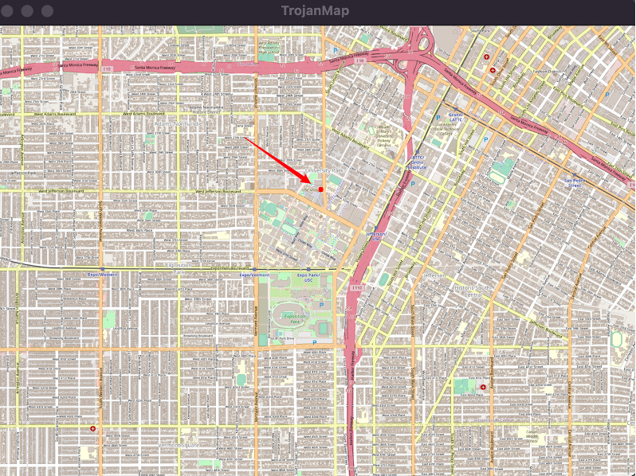</p>

## item2-2: Check Edit Distance Between Two Location Names 

### Description

Used a 2D vector of size (m+1) x (n+1) to store the edit distances between all possible substrings of the two input strings.

<p align="center">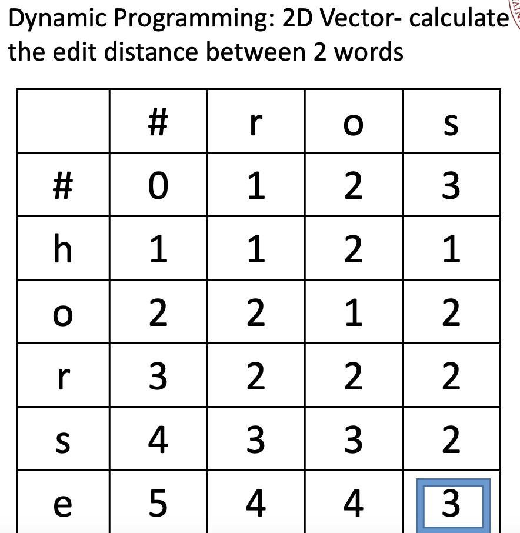</p>

### time complexity and run time cost
- time complexity: O(m * n), where m and n are the lengths of the input strings.

## item3: Get All Categories

### Description
 it returns a vector of strings containing all the unique categories that are associated with any location in the data member variable of the TrojanMap class. The algorithm used is a simple nested loop, where the outer loop iterates over all the nodes (i.e., locations) in the data map and the inner loop iterates over all the attributes (i.e., categories) associated with that node. For each attribute, it checks if it already exists in the Categories vector using the std::find algorithm. If the attribute is not present, it adds it to the Categories vector. Finally, the function returns the Categories vector containing all the unique categories associated with any location in the data map.

### time complexity and run time cost
- time complexity: O(nmlog(m))), where n is the number of nodes in the graph and m is the average number of attributes per node
- run time: 2ms

## item4: Get All Locations In A Category

### algorithm and data structure
The algorithm loops through all the nodes in the data map, which represents all the locations in the TrojanMap, and for each node, it loops through all the attributes of that location. It checks if the current attribute matches the input category. If it does, then it adds the ID of that node to the result vector.

The data structure used in this function is a map, which stores all the nodes in the TrojanMap. Each node is represented by a struct that contains various attributes of that location, including the ID, name, latitude, longitude, and a vector of attributes. The function uses a vector to store the result, which is a collection of location IDs that belong to the given category.

### desciption
 takes a category as an input and returns a vector of all the locations that belong to that category.

 ### time complexity and run time cost
 - time complexity: O(n*m), where n is the number of nodes in the data map and m is the maximum number of attributes that any node can have
 - run time cost:7ms

 ## item5: Get Locations Using A Regular Expression

 ### algorithm and data structure
used a map called data, which maps a location ID to its corresponding location information. It also uses a vector called ids to store the location IDs that match the regular expression.

### time ecomplexity and run time cost
- time complexity: O(nm), where n is the number of nodes in the data map, and m is the length of the regular expression pattern
- run time cost: 81ms

## item6: CalculateShortestPath between two places
 
### algorithm and data structure
The algorithms used are Dijkstra's algorithm and Bellman-Ford algorithm, the data structure used to represent the graph is an adjacency list. Each node of the graph is represented by a struct that contains the node's ID, name, latitude, longitude, and a vector of its neighbors.

In Dijkstra's algorithm, the priority queue is implemented using a min-heap. The heap stores pairs of the distance to a node and the node's ID. The visited nodes are marked using an unordered map.

In Bellman-Ford algorithm, the shortest distances are updated iteratively. The algorithm starts by initializing all distances to INT_MAX except for the starting node which is set to 0. The visited nodes are marked using an unordered map.
### description

<p align="center">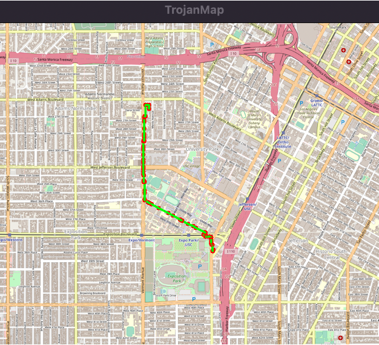</p>

### time ecomplexity and run time cost
- time complexity: The time complexity of Dijkstra's algorithm and Bellman-Ford algorithm depends on the number of nodes and edges in the graph. In the worst case, both algorithms have a time complexity of O(ElogV) where E is the number of edges and V is the number of vertices. However, Dijkstra's algorithm is faster than Bellman-Ford algorithm in most cases because it has a better average time complexity of O(E+VlogV).

- run time cost: 

| Point A to Point B      | Dijkstra(ms) | Bellman Ford(ms)|
| -------------------- | ----------- |-------|
| Chick-fil-A - Ralphs        | 124     | 7769| 
| Target - Chick-fil-A        | 84      | 8338|
| Target - KFC                | 67      | 8049| 
| Ralphs - Target             | 77      | 8400| 
| Food Mart - KFC             | 133     | 7698|
| Food Mart - Ralphs          | 119     | 7988|
| Target - Trader Joes        | 44      | 8083| 
| Trader Joes - Food Mart     | 156     | 8177| 
| Food Mart -  Chick-fil-A    | 97      | 7929| 
| Chick-fil-A - Trader Joes   | 83      | 7751| 
| Trader Joes - KFC           | 67      | 8056| 
| KFC - Chinese Street Food   | 35      | 48  | 
| Saint James Park - Target   | 48      | 9529| 
| Chinese Street Food - Ralphs| 97      | 7975| 
| Chinese Street Food - Target| 44      | 7821| 


## item7:  Cycle Detection

### algorithm and data structure
DFS, undirected graph


### description


The algorithm uses an unordered map to keep track of the status of each node during the DFS. Initially, all nodes are marked as unvisited (status = 0). For each start node in the subgraph, the CycleDetectionHelper function is called to perform the DFS.

The CycleDetectionHelper function marks the start node as visited (status = 1) and iterates over all its adjacent nodes that are within the square boundaries. If an adjacent node is already marked as visited and its parent is not the current node, then a cycle has been detected and the function returns true.

Otherwise, if the adjacent node is unvisited, it is marked as visited and its parent is set to the current node. The function then recursively calls itself on the adjacent node.

Once all adjacent nodes have been processed, the current node is marked as finished (status = 2) and the function returns false. If no cycles are detected for any start node in the subgraph, the function returns false.

Example 1:
```shell
Input: square = {-118.299, -118.264, 34.032, 34.011}
Output: true
```
Here we use the whole original graph as our subgraph. 
<p align="center"></p>

Example 2:
```shell
Input: square = {-118.290, -118.289, 34.030, 34.020}
Output: false
```
Here we use a square area inside USC campus as our subgraph
<p align="center">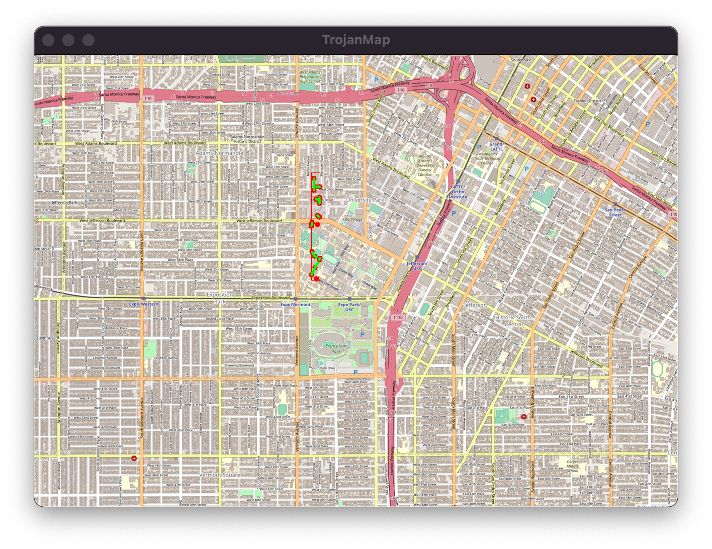</p>

Example 3:
```shell
Input: square = {-118.290, -118.289, 34.030, 34.020}
Output: true
```
Here we use a square area inside USC campus as our subgraph
<p align="center">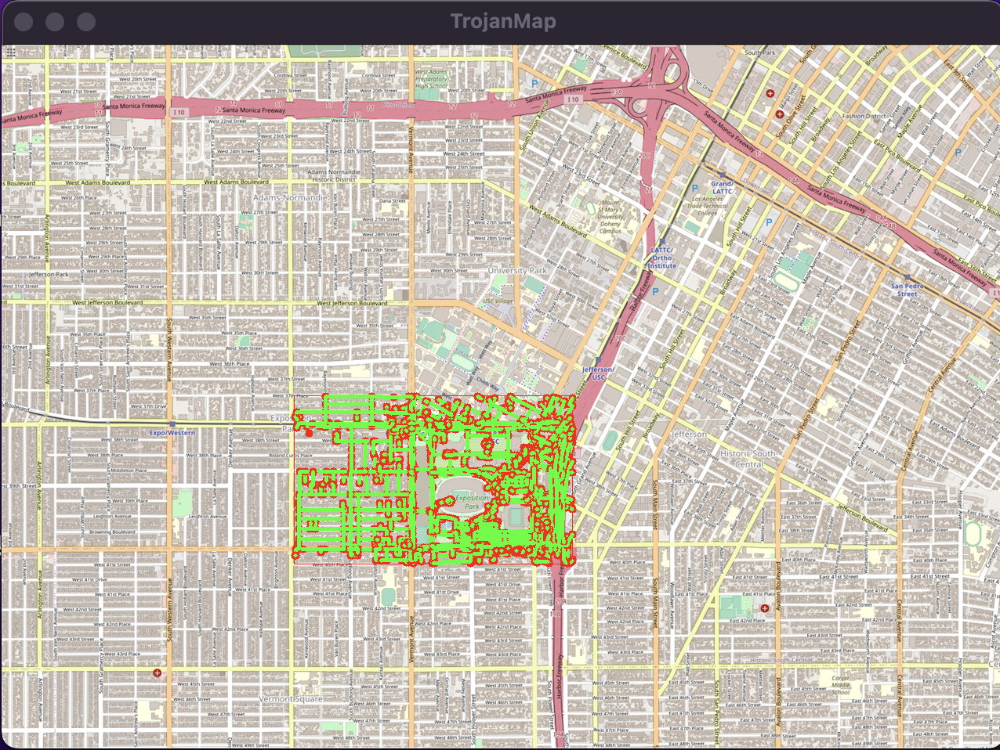</p>

Example 4:
```shell
Input: square = {-118.290, -118.289, 34.030, 34.020}
Output: true
```
Here we use a square area inside USC campus as our subgraph
<p align="center">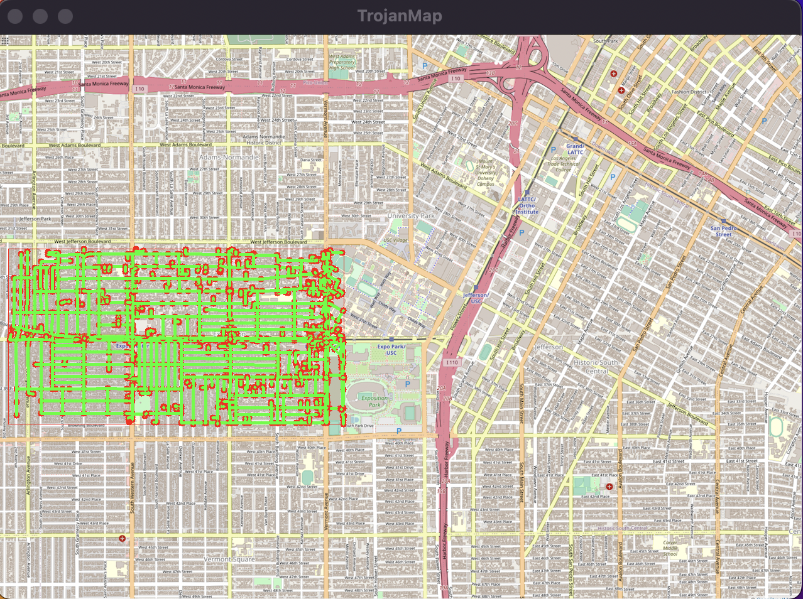</p>

Example 5:
```shell
Input: square = {-118.290, -118.289, 34.030, 34.025}
Output: false
```
Here we use a square area inside USC campus as our subgraph
<p align="center">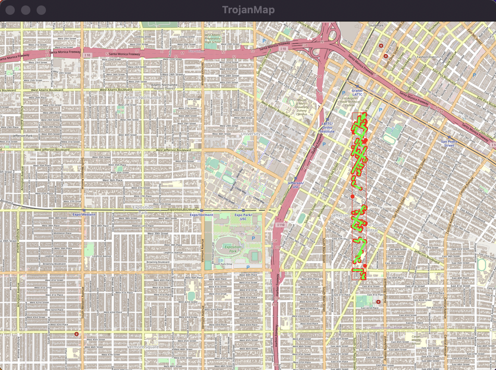</p>

### time complexity and run time cost
- time complexity: O(V + E), where V is the number of nodes in the subgraph and E is the total number of edges in the subgraph.
- run time cost: for the examples shown above, the run times are: 316ms, 1ms, 61ms, 13ms, 2ms. As teh region area expanded, the run time cost grow.


## item8: Topological Sort
 
### slgprithm and data structure

BFS, directed graph

### description
 it takes in a vector of locations and a 2D vector of dependencies between locations, and returns a topological ordering of the locations that satisfies the dependencies. The algorithm used is a variation of the breadth-first search (BFS) algorithm that performs a topological sort on a directed acyclic graph (DAG).

- My topological sort results for 6 nodes

```shell
Input: 
location_names = {"Ralphs", "Target", "Food Mart" ,"Chick-fil-A", "KFC", "Starbucks"}
dependencies = {{Ralphs,Chick-fil-A}, {Ralphs,KFC}, {Chick-fil-A,KFC},{Ralphs,Food Mart},{Food Mart,Chick-fil-A},{KFC,Target},{Ralphs,Target},{Target, Starbucks}}
```

```shell
*************************Results******************************
Topological Sorting Results:
Ralphs
Food Mart
Chick-fil-A
KFC
Target
Starbucks
**************************************************************
Time taken by function: 0 ms
```
<p align="center">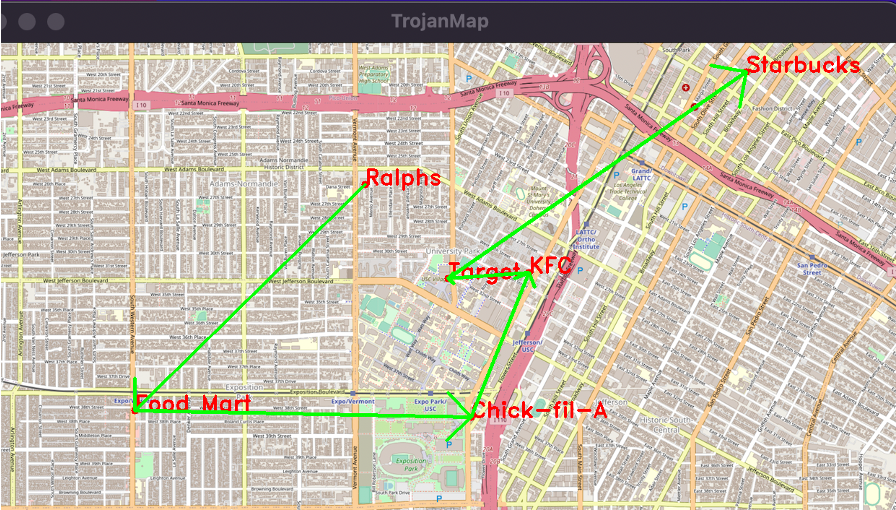</p>


### time ecomplexity and run time cost
- time complexity: O(|V|+|E|), where |V| is the number of vertices (locations) and |E| is the number of edges (dependencies) in the graph.
- run time cost: 0ms

## item9: The Traveling Trojan Problem (AKA Traveling Salesman!) 
 
### algorithm and data structure
- brute-force algorithm: 
for the Traveling Trojan problem which tries all possible permutations of the given locations to find the shortest path.

The algorithm uses recursion to find all permutations of the given locations, and then calculates the total distance of each permutation using the CalculatePathLength function. The shortest path is stored in min_path and the length of the shortest path is stored in records.first. The algorithm also keeps track of all the paths with the same length as the shortest path in records.second.

- backtracking: 
It initializes the current path to contain only the first location, and then calls the recursive helper function backTrackTravelingTrojan with the current path, location ids, and records. The backTrackTravelingTrojan function performs the backtracking by iterating over the remaining locations and adding them to the current path one by one, checking if the path length is less than the current shortest distance, and recursively calling itself until it has visited all the locations. If it finds a shorter path, it updates the records accordingly.

- 2-opt
 swapping two edges in the route to obtain a new route, and checking if the new route is shorter than the previous one. keep the shortest one.
- 3-opt
swapping three edges of the tour to create a new tour, until no further improvements can be made. keep the shortest one.

### description

- brute force
<p align="center"></p>

- backtracking

<p align="center"></p>

- 2-opt

<p align="center"></p>

- 3-opt

<p align="center">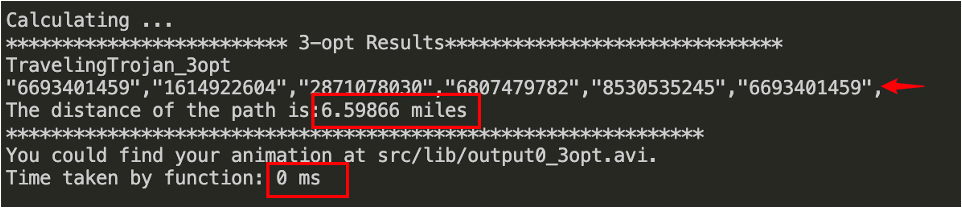</p>

- result TSP path

<p align="center"></p>

### time ecomplexity and run time cost

- time complexity: 

| Brute Force      | Backtrackiing | 2-opt| 3-opt|
| -------------------- | ----------- |----|----|
|  O(n!)           |  O(n!)        | O(n^3)      | O(n^4)     |

- run time cost: 

| Number of nodes      | Time with brute force algorithm | Time with backtrcking algorithm| Time with 2-opt algorithm| Time with 3-opt algorithm|
| -------------------- | ----------- |----|----|----|
|  4           |  2        | 0       | 0     |  0    |
|  5           |  2        | 0       | 0     |  0    |
|  6           |  15       | 3       | 0     |  1    |
|  7           |  99       | 14      | 1     |  3    |
|  8           |  timeout  | 92      | 2     |  8    |
|  9           |  timeout  | 474     | 3     |  16   |
|  10          |  timeout  | 2637    | 5     |  32   |
|  11          |  timeout  | 30581   | 8     |  55   |
|  12          |  timeout  | 39888   | 10    |  96   |
|  13          |  timeout  | 398412  | 14    |  140  |
|  14          |  timeout  | timeout | 21    |  251  |
|  15          |  timeout  | timeout | 25    |  315  |
|  16          |  timeout  | timeout | 35    |  479  |
|  17          |  timeout  | timeout | 43    |  593  |
|  18          |  timeout  | timeout | 50    |  1036 |

## item10: Find Nearby

### algorithm
The algorithm first initializes an empty vector of strings called "res" and a set of pairs containing a double and a string called "nearLoc". It then calls another function named "GetAllLocationsFromCategory" to get a vector of strings that contains all the locations with the given attribute name.

Next, the algorithm iterates through all the locations obtained from the previous step and calculates their distance to the given location named "name" using the function named "CalculateDistance". It then inserts the distance and location pairs into the "nearLoc" set.

After that, the algorithm iterates through the "nearLoc" set and checks if the distance is less than r. If so, it adds the location to the "res" vector until the vector's size is k or there are no more locations left in the set.

Finally, the algorithm returns the "res" vector containing the k nearest locations that have the same attribute name and are within a radius of r from the given location named "name".

### description

<p align="center">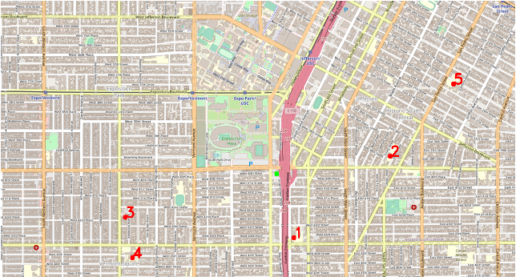</p>

### time ecomplexity and run time cost
- time complexity: O(n log n), where n is the total number of locations with the given attribute name. 
- run time cost: 21ms

## item11: Find the Shortest Path to Visit All locations 
 
### algorithm and data structure
The algorithm uses Dijkstra's algorithm to calculate the shortest path between each pair of locations and stores the paths and distances in two maps: adj_path and adj_dis. It then uses a backtracking algorithm to find the minimum distance path that visits all the locations. Finally, it returns the path as a vector of strings.

The data structures used in the algorithm are vectors, maps, and sets. The vector location_ids stores the ids of the input locations, adj_path and adj_dis are maps used to store paths and distances between locations, and the set visited is used to keep track of visited locations during the backtracking algorithm.
### description

<p align="center">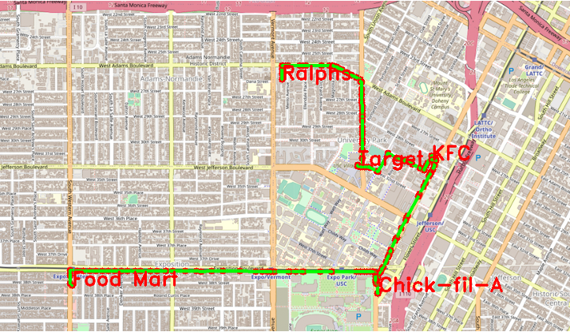</p>

### time ecomplexity and run time cost

- time complexity: O(n^3) where n is the number of locations. The Dijkstra's algorithm for each pair of locations has a time complexity of O(E log V) where E is the number of edges and V is the number of vertices. In the worst case, E can be O(V^2), so the time complexity of Dijkstra's algorithm for each pair of locations is O(V^2 log V). Since there are n pairs of locations, the total time complexity of Dijkstra's algorithm is O(n V^2 log V). The backtracking algorithm has a time complexity of O(n!), so the overall time complexity is O(n^3 + n V^2 log V + n!). 

- run time cost: 1387ms(it will grow as the number of locations grow)

## item12: Check the existence of the path with a constrained gas tank
 
### algorithm and data structure
The algorithm uses BFS to find a path between the start and end locations, where the distance between two neighboring locations is less than or equal to the maximum distance that can be traveled with a full tank of gas. The algorithm iterates through each query, performs the BFS starting from the start location, and sets the corresponding boolean value in the output vector to true if a path is found.

The data structures used in the algorithm are a queue to store the locations to be visited in the BFS, an unordered map to keep track of visited locations, and the functions GetID, GetNeighborIDs, and CalculateDistance to obtain information about the locations in the map.

### description

<p align="center">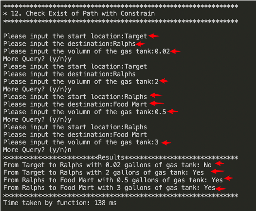</p>

### time ecomplexity and run time cost
- time complexity: O(Q * N * M), where Q is the number of queries, N is the number of locations in the map, and M is the maximum number of neighbors for any location. 
- run time cost: 138ms


# Discussion/Conclusion
- for TSP, 2-OPT is the fastest, the time complexity is O(n^3), but 2-opt and 3-opt sometimes cannot get to the best result of optimization
- for calculate shortest path, Dijkastra(O(E+VlogV)) is faster than Bellman_ford(O(ElogV)), the optimized Bellman_ford is faster than Bellman_ford because it discard the visited nodes.
- DFS can be used for finding paths, connected components, and cycles in a graph. Its recursive nature also makes it useful in certain types of backtracking problems, where we want to explore all possible solutions. However, DFS can get stuck in infinite loops if the graph has cycles, so it's important to mark visited nodes to avoid revisiting them.
- We typically use DFS instead of BFS for cycle detection because DFS is well-suited for exploring deeper into a graph. In DFS, we explore the graph by traversing one path as far as possible before backtracking and exploring other paths. This makes it a good fit for cycle detection because we can keep track of visited nodes and explore deeper until we find a cycle.
- BFS is useful for finding the shortest path or distance between two nodes in an unweighted graph. Since it explores nodes in order of their distance from the starting node, it can guarantee that the first time a node is visited, it has the shortest distance from the starting node.
- We use BFS  instead of DFS in topological sorting because it's better for finding a topological ordering of a directed acyclic graph (DAG). In a DAG, there exists at least one vertex with zero in-degree (no incoming edges), and this vertex can be added to the topological order without violating the order. After removing this vertex, there may be another vertex with zero in-degree, and this process can be repeated until all vertices are included in the topological order.,BFS uses a queue to process nodes layer by layer, which makes it a good choice for topological sorting. In each iteration of the BFS, we add all nodes with zero in-degree to the queue, remove them from the graph, and update the in-degree of their neighbors. By repeating this process, we can obtain a topological order of the nodes.
 
- Backtracking is a technique for solving problems by exploring all possible solutions, incrementally building a candidate solution, and abandoning a candidate as soon as it's determined to be invalid. It's particularly useful when we want to find all solutions to a problem, or when we need to search for a solution in a large search space. Backtracking is often implemented using recursion, and it can be used in combination with DFS or BFS to explore all possible paths or solutions. However, backtracking can be computationally expensive, so it's important to prune the search space whenever possible.
# lessons learned
- Put the Algorithm and Data Structure learned in class into practice. (e.g. BFS, DFS, Dijkstra, Bellman Ford, Backtracking; Tree, Graphs, Map, List … )
- Dynamic Programming(Especially the one FindClosestName() is amazing!)
- Achieve some interesting and useful function that haven’t encountered before(TSP, Cycle Detection in subgraph)
- Learned some new Algorithms(2-opt, 3-opt, Genetic Algorithm)
- Got introduced to the usage of OpenCV and Ncurses.
- Consolidate the C++ programming style


